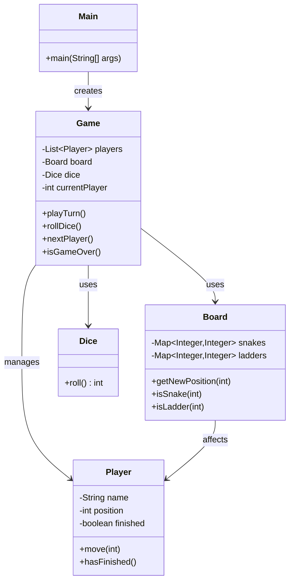

# Snake-Ladders

## Overview
**Snake-Ladders** is a multi-user implementation of the classic **Snakes and Ladders** board game written in Java. The game simulates the traditional board game experience where players race from square 1 to square 100, using dice rolls to advance their token. Along the way, ladders help players climb ahead, while snakes send them backward — introducing both excitement and unpredictability to gameplay. :contentReference[oaicite:1]{index=1}

## Features
- Supports multiple players
- Traditional Snakes and Ladders board with 100 squares
- Snakes and ladders placed at predetermined locations
- Exact roll required to reach the final square (100)
- Board mechanics with snakes, ladders, and additional game effects
- Implemented in Java for desktop execution :contentReference[oaicite:2]{index=2}

## Game Rules
- Players start on square **1** and take turns rolling a standard 6-sided die.
- If a player lands on the start of a ladder, they climb to its top.
- If a player lands on the head of a snake, they slide down to its tail.
- Reaching square **100** exactly is required to win — overshooting keeps the player in place.
- If a player rolls a **6**, they earn an additional turn.
- The game continues until all but one player have reached square **100**. :contentReference[oaicite:3]{index=3}

## Tech Stack
- **Language:** Java  
- **Platform:** Standard JDK (no external frameworks)  
- **Game Type:** Turn-based board game simulation :contentReference[oaicite:4]{index=4}

## Installation

### Prerequisites
- Java Development Kit (JDK) 8 or higher

### Clone the Repository
`git clone https://github.com/BenDXC/Snake-Ladders.git`

### Compile & Run
Navigate to the project root and compile the Java source
`javac -d out src/com/*.java`
Then run the game:
`java -cp out com.Main`

# Usage
Launch the application with java com.Main from the compiled directory.
Enter the number of players.
Take turns rolling the die.
Watch as players advance, climb ladders, and slide down snakes.
The first player to land exactly on square 100 wins.

# Project Structure
```
Snake-Ladders/
├── src/
│   └── com/
│       ├── Game.java
│       ├── Board.java
│       ├── Player.java
│       └── Main.java
├── LICENSE
└── README.md
```

# 🧠 1. Main.java

## Responsibility:
Entry point of the game. Responsible for initializing the game, reading user input (number of players), and starting the game loop.

## Key Methods
main(String[] args): Launches the game and sets up initial state.
start(): Begins the turn-based loop.

# 🧱 2. Game.java

## Responsibility:
Central game engine; manages player turns, dice rolls, game state, and win conditions.

## Key Methods
rollDice(): Simulates dice roll (1–6).
playTurn(Player player): Handles a single player’s turn including movement and checks for snakes/ladders.
isGameOver(): Checks whether all but one player have reached the finish (square 100).
nextPlayer(): Advances to the next turn.

# 🗺️ 3. Board.java

## Responsibility:
Represents the Snakes & Ladders board. Stores the positions of snakes and ladders, and defines board rules.

## Key Properties
Map<Integer, Integer> snakes: Maps snake head → tail.
Map<Integer, Integer> ladders: Maps ladder base → top.

## Key Methods
getNewPosition(int position): Returns updated position after snakes/ladders.
isSnake(int square): Returns true if square is snake head.
isLadder(int square): Returns true if ladder base.

# 🎲 4. Dice.java

## Responsibility:
Simulates dice rolling and enforces rules such as extra turn on a roll of 6.

## Key Methods
roll(): Returns a random integer between 1 and 6.
isExtraTurn(int roll): Returns true if roll == 6.

# 🙍 5. Player.java

## Responsibility:
Keeps track of a player’s name, current position, and game state (finished/not).

## Key Members
String name
int position
boolean finished

## Key Methods
move(int steps): Moves player forward.
applyBoardEffect(int newPosition): Applies effects of snakes or ladders.

# 📌 Tips for Maintainable Logic Layer

✅ Separate logic from UI — e.g., no System.out.println in Game.java

✅ Use enums for game constants (e.g., MAX_SQUARE = 100)

✅ Unit test board logic (e.g., snakes/ladders movement)

✅ Document edge cases like extra turns on 6 & exact finish rule 

# 🏗️ Design
Overview

The Snake‑Ladders game is designed with a modular, object-oriented architecture. 

The design separates concerns across multiple classes, enabling maintainability, readability, and scalability. 

Each class has a clear responsibility, following SOLID principles where possible.

# UML




# 🧠 UML Design Notes
Single Responsibility Principle applied to all classes

Loose coupling between logic and entry point

Game acts as the controller

Board encapsulates all board rules

Player remains a lightweight data model

# License

This project is licensed under the GNU General Public License v3.0 (GPL-3.0). You are free to use, modify, and distribute this software under the terms of the license.

